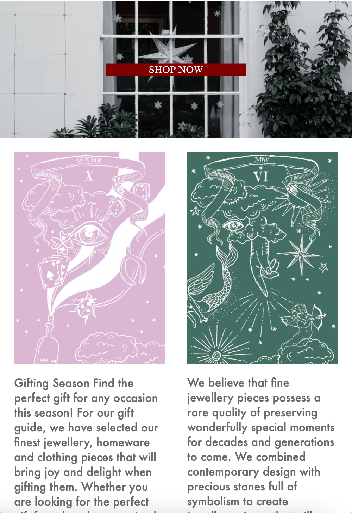
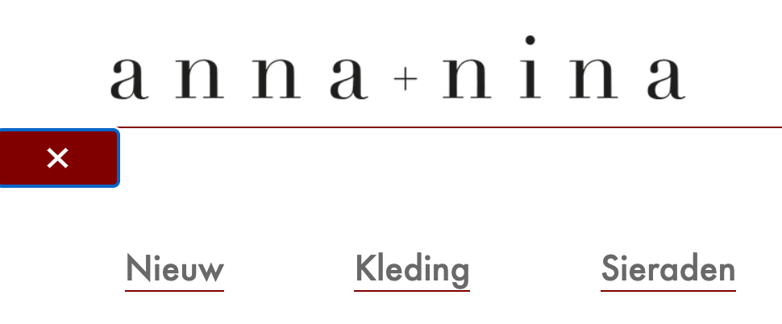

# Procesverslag
Markdown is een simpele manier om HTML te schrijven.  
Markdown cheat cheet: [Hulp bij het schrijven van Markdown](https://github.com/adam-p/markdown-here/wiki/Markdown-Cheatsheet).

Nb. De standaardstructuur en de spartaanse opmaak van de README.md zijn helemaal prima. Het gaat om de inhoud van je procesverslag. Besteedt de tijd voor pracht en praal aan je website.

Nb. Door *open* toe te voegen aan een *details* element kun je deze standaard open zetten. Fijn om dat steeds voor de relevante stuk(ken) te doen.

## Jij

  
uitwerken voor kick-off werkgroep

  ### Auteur:
  Sam Dekker

  #### Je startniveau:
  Blauw

  #### Je focus:
  Responsive
 

## Je website

  
uitwerken voor kick-off werkgroep

  ### Je opdracht:
  https://www.anna-nina.nl/nl

  #### Screenshot(s) van de eerste pagina (small screen): 
  Homepagina

  
  
  
  
  #### Screenshot(s) van de tweede pagina (small screen):
Detailpagina

 
 
  

## Toegankelijkheidstest 1/2 (week 1)

  
uitwerken na test in 1e werkgroep

  ### Bevindingen
  Lijst met je bevindingen die in de test naar voren kwamen:
  

  #### Screenreader
  De site werkte best wel goed met de screenreader test. Hij zegt duidelijk de naam van alle linkjes, hij zegt als het een uitvouwmenu is en hoeveel items er precies staan in dit menu. Ook de producten die verkocht worden worden duidelijk omschreven. Het enige probleem wat ik opmerkte tijdens het doorlopen van de site was dat als je bij de main van de pagina wilde komen dat je eerst door heel veel menu opties moest doorklikken. Hij opent zeg maar elk kopje zoals "kleding" en gaat vervolgens alle categorieen af. Dit duurt best wel lang. Het zou handiger zijn als als je zelf kan kiezen of je het kopje "kleding" wilt openen of skippen zodat je zo sneller door de pagina heen kan.

   

  #### Muis en Toetsenbord 
  De site is goed te doorlopen met alleen het toetsenbord. De tab loopt gewoon de hele pagina af en je ziet het duidelijk waar de tab op dat moment staat. Opnieuw moet je wel weer het hele menu doorlopen om bij je main te komen wat wel erg lang duurt.

  

  #### Motoriek (shocks, elastiekjes)
  De site valt goed te besturen met een slechtere motoriek. Ik heb vooral gemerkt dat het allemaal wat langer duurt. Ook staan de tekstjes in het menu erg dicht op elkaar waardoor je soms mis klikt. 

  

  #### Visueel (brillen, contrast, kleurenblind, dark/light). 
  Opzich is de site redelijk goed te zien. Wel zijn sommige letters erg klein en dun. De letters zijn grijs en staan voor een witte achtergrond. Voor slechtziende kan dit wat moeilijk te lezen zijn. Een groter of dikker lettertype zou dit probleem oplossen.

  

## Breakdownschets (week 1)

  
uitwerken na afloop 2e werkgroep

  ### de hele pagina: 
  
  

## Voortgang 1 (week 2)

  
uitwerken voor 1e voortgang

  ### Stand van zaken
  Ik heb de meeste opdrachten gemaakt en het ging me tot nu toe best goed af. Ook heb ik het eerste begin aan mijn website gemaakt. Dit gaat best goed. Ik kan de uitkomsten van de opdrachten goed gebruiken bij mijn eigen website. Soms lukken wat kleine dingen niet helemaal maar over het algemeen ben ik nog niet echt ergens tegenaan gelopen. 
  Wel wil ik weten hoe ik mijn button op de juiste plek kan krijgen.

  ### Agenda voor meeting
  samen met je groepje opstellen

Noah:
Vraag website

Isa:
Vraag website

Aleid:
Vraag website

Sam:
Bespreken website, vraag button

  ### Verslag van meeting
  De button op de juiste plek krijgen wordt uitgelegd in 1 van de opdrachten. Verder moet ik gwn doorgaan met content op mn site zetten en dit gaan vormgeven.

## Voortgang 2 (week 3)

  
uitwerken voor 2e voortgang

  ### Stand van zaken
  Naar mate ik verder ging werken merkte ik toch dat ik een beetje vast liep. De header kon ik maken op basis van de opdrachten maar nu liep ik een beetje vast. Gelukkig hielp het mij heel erg om met klasgenoten samen aan de slag te gaan. Hierdoor begon ik het weer beter te begrijpen en wist ik weer hoe ik verder moest. 

  Ik merk heel erg dat als je eenmaal bezig bent het redelijk goed gaat. Ook begin ik steeds beter te begrijpen wat ik nou precies doe.

  In de meeting ga ik vragen of wat ik tot nu toe heb goed is. Ook wil ik weten of het mogelijk is om te scrollen door afbeeldingen. 

  ### Agenda voor meeting
  samen met je groepje opstellen

Noah:
Vraag website

Isa:
Vraag website

Aleid:
Vraag website

Sam:
Hoe nu verder

  ### Verslag van meeting

## Toegankelijkheidstest 2/2 (week 4)

  
uitwerken na test in 8e werkgroep

  ### Bevindingen
  Lijst met je bevindingen die in de test naar voren kwamen (geef ook aan wat er verbeterd is):

  #### Screenreader
  De screenreader test ging eigenlijk erg goed. De voiceover vertelde duidelijk wat alles wat omdat ik bij elke afbeelding een alt heb gezet. Hierdoor weet de gebruiker precies wat er te zien is. Ook heb ik het menu kort gehouden zodat de gebruiker hier makkelijk doorheen kan navigeren. Dit is een stuk beter dan de website hiervoor

  

  #### Muis en Toetsenbord 
  De website kan makkelijk bestuurd worden met de tab. Ik heb nog extra duidelijk een focus state toegevoegd bij de buttons zodat je extra duidelijk kan zien waar je bent in de website.

  #### Motoriek (shocks, elastiekjes)
  Bij de oude website merkte ik dat er veel nogal kleine linkjes dicht op elkaar stonden waardoor je soms naast klikte. Ik heb er nu voor gezorgt dat de nav groot genoeg is en het ver uit elkaar staat zodat je dit probleem voorkomt. Dit werkte in de test dan ook goed.

  #### Visueel (brillen, contrast, kleurenblind, dark/light). 
  De tekst is groot en er is een groot genoeg contrast. Wel is de tekst in de buttons nog wat klein, dit kan moeilijker te lezen zijn.

## Voortgang 3 (week 4)

  
uitwerken voor 3e voortgang

  ### Stand van zaken

  Eigenlijk ben ik al best tevreden met mijn site. Hij is zo goed als af en ik ben ook erg trots op het resultaat. Ik denk ook dat ik het meeste wat ik heb gedaan ik goed begrijp. Wel moet ik nog de animaties en javascript nog toevoegen. De animaties lijkt me redelijk te doen maar vooral de javascript vind ik erg lastig. Hier wil ik dan ook naar vragen.

  ### Agenda voor meeting
  
Noah:
Vraag website

Isa:
Vraag website

Aleid:
Vraag website

Sam:
Javascript en animaties

  ### Verslag van meeting
  
  Het is gelukt om de animaties toe te voegen, het lag aan een kleine schoonheidsfout. Ik moest namelijk nog de animation duration toevoegen om het te laten werken. De javascript ben ik nog niet helemaal aan toe gekomen.

## Eindgesprek (week 5)

  
uitwerken voor eindgesprek

  ### Je uitkomst - karakteristiek screenshots:
  

  
  
  

  

  ### Dit ging goed/Heb ik geleerd: 
  
  Aan het begin kwam ik wat lastig op gang omdat ik niet zo goed wist waar ik moest beginnen. Ik merkte wel snel dat ik het steeds beter ging begrijpen. Over het algemeen ging de html en de css typen best wel goed. Het vormgeven lukte me over het algemeen wel en ben ik ook echt beter in geworden dan eerst.

  

  ### Dit was lastig/Is niet gelukt:
  Op het laatste moest ik alleen nog javascript toevoegen. De javascript zelf schrijven ging best makkelijk maar werkte toch steeds niet of voegde niet echt iets toe aan mn site. Daarom wilde ik een menu toevoegen. Dit is uiteindelijk gelukt maar het ging niet heel erg makkelijk. Het ziet er uiteindelijk ook niet helemaal uit zoals ik wilde.

  De form in de footer wilde ik mee laten schalen wanneer je het scherm groter of kleiner maakt. Dit is soort van gelukt maar ook niet helemaal ideaal.

  

## Bronnenlijst

  
continu bijhouden terwijl je werkt

Voor content site:
https://www.anna-nina.nl/nl

Uitleg over javascript:
https://stackoverflow.com/questions/31747990/need-to-bounce-an-icon-button-without-jquery-ui

Hover:
https://www.w3schools.com/cssref/sel_hover.php
https://www.w3schools.com/howto/howto_css_zoom_hover.asp

